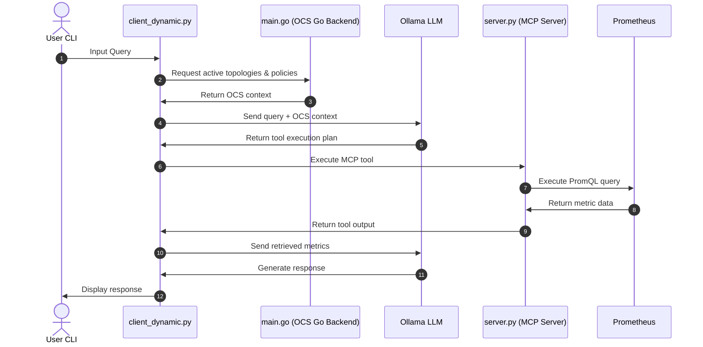
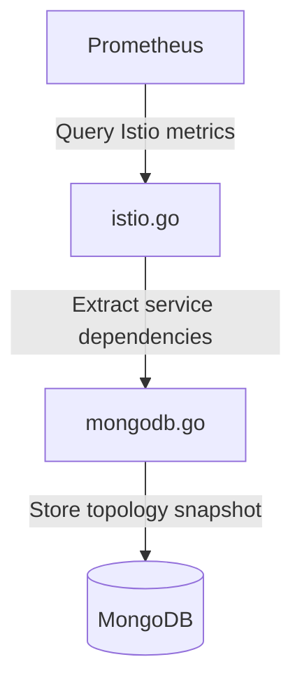
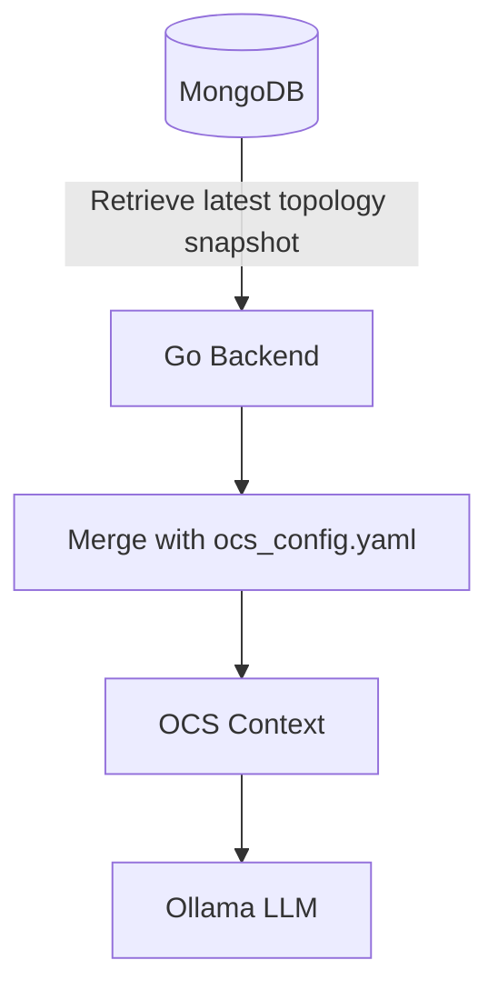

# Prometheus Context Interaction Flow

This document describes the interaction flow of the Prometheus agent in SODA Contexture. It explains how topology context is collected from Prometheus, stored in MongoDB, and later consumed during query execution.

The Prometheus agent has two primary responsibilities within Contexture:

1. **Generating topology context** from Prometheus metrics and storing it in MongoDB.
2. **Providing live metric data** through the MCP server during query execution.

---

## 1. Query Execution Flow

The following sequence illustrates how a user query is processed.


### OCS Context Retrieval

Before invoking the LLM, the client requests the latest OCS Context from the Go backend.

**Request**

```http
GET /get_ocs_prompt
```

**Response**

Returns the latest **OCS Context**, constructed by combining the latest topology snapshot retrieved from MongoDB with the metric definitions and policies defined in `ocs_config.yaml`.

**Example Response**

```json
{
  "spec_version": "0.1",
  "context_definitions": [
    {
      "resource_id": "workload-db",
      "identity": {
        "workload": "db"
      },
      "metrics": [
        {
          "Name": "container_cpu_usage_seconds_total",
          "HealthConfig": {
            "critical_threshold": 90
          }
        }
      ],
      "policy": [
        "sla violation if container cpu usage exceeds 90 seconds"
      ]
    }
  ]
}
```

During query execution:

1. The client requests the latest OCS context from the Go backend.
2. The Go backend retrieves the latest topology snapshot from MongoDB and constructs the OCS Context.
3. The LLM determines which metrics are required and invokes the corresponding MCP tools.
4. The MCP server executes live PromQL queries against Prometheus.
5. The retrieved metrics are supplied back to the LLM to generate the final response.


---

## 2. Context Generation

### Data Population Trigger

The topology context is generated independently of user queries by invoking the following endpoint:

```bash
curl -X POST http://localhost:8000/collect_istio_metrics
```

This process is independent of user queries and populates MongoDB with the latest topology snapshot.

---

### Context Generation Flow

The topology collector queries Prometheus for Istio service mesh metrics (`istio_requests_total`). It extracts the `source_workload` and `destination_workload` labels from these metrics to construct the service dependency graph.



---

### Stored Context

The generated topology is stored in the `workload_adjacency` collection.

```json
{
  "adjacency_list": {
    "frontend": ["backend"],
    "backend": ["db"]
  },
  "timestamp": "2026-07-02T15:04:26Z",
  "source_count": 2,
  "total_connections": 2
}
```

> Only service-to-service topology is stored. Raw Prometheus metric samples (such as CPU and memory values) are not persisted.

---

## 3. Context Consumption

During query execution, the Go backend retrieves the latest topology snapshot from MongoDB and combines it with the metric definitions and policies from ocs_config.yaml to construct the OCS Context supplied to the LLM.



> The current implementation always retrieves the latest topology snapshot for every request to GET /get_ocs_prompt. The topology retrieval is not filtered based on the user's query; instead, the latest available topology snapshot is used to construct the OCS Context supplied to the LLM.

---

## 4. Components and Files

| File | Responsibility |
|------|----------------|
| `pkg/mcp/client_dynamic.py` | Orchestrates query execution |
| `pkg/ocs/main.go` | Retrieves and serves OCS context |
| `pkg/ocs/internal/server/handlers.go` | Handles topology collection requests and MongoDB operations |
| `pkg/ocs/internal/store/mongodb.go` | Stores and retrieves topology snapshots |
| `pkg/ocs/topology/mesh/istio/istio.go` | Queries Prometheus and builds the service dependency graph |
| `pkg/mcp/server.py` | Executes live PromQL queries through the MCP server |
| `config/prometheus_config.yaml` | Prometheus connection configuration |
| `config/ollama_config.yaml` | Ollama model configuration |
| `config/mcp_server_config.yaml` | MCP server configuration |