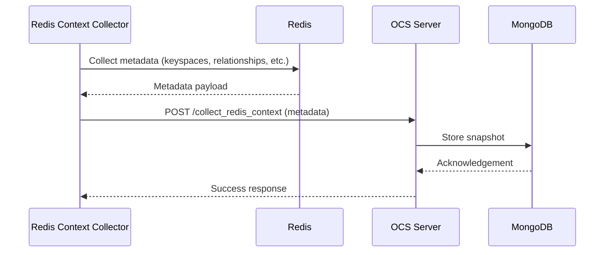
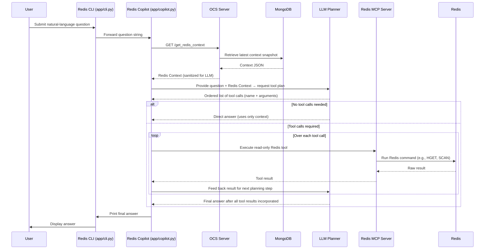

# Redis Agent

## 1. Overview

The **Redis Agent** is the Redis‑specific Copilot in the **Contexture** platform. It answers natural‑language questions about live Redis data by combining:

- **Precomputed Redis Context** (schema, keyspaces, relationships) collected once via the OCS service and stored in MongoDB.
- **Live Redis queries** executed at request time through a read‑only MCP server.

This separation enables fast, context‑aware answers without scanning the entire database for every query.

---

## 2. Architecture

| Component | Brief Description |
|---|---|
| **Redis** | The source data store whose keys/values are queried at run‑time. |
| **Redis Context Collector** | Inspects Redis metadata (keyspaces, relationships, etc.) and produces a structured context snapshot. |
| **MongoDB** | Persists the collected Redis Context snapshots. |
| **OCS Server** | Exposes `POST /collect_redis_context` and `GET /get_redis_context`; the only bridge between the agent and MongoDB. |
| **Redis Copilot** | Orchestrates the request flow: fetches context, invokes the LLM planner, runs MCP tools, and returns the final answer. |
| **Redis MCP Server** | Provides **read‑only** Redis tool endpoints used by the Copilot during query execution. |
| **LLM** | Plans which Redis tools to call based on the precomputed context and the user question, then generates the natural‑language answer. |

> **Sanitizer** – All Redis context and tool results pass through a policy‑based sanitization layer before being used for planning, logging, or final answer generation. Sensitive fields are protected according to configurable sanitization policies.

---

## 3. Redis Context Collection Flow



The collector runs on demand (or manually) to generate a snapshot, which OCS stores in MongoDB. Subsequent queries reuse this snapshot, avoiding repeated full scans of Redis.

---

## 4. Redis Query Interaction Flow (Detailed)



User asks a query. The Copilot first fetches the precomputed Redis Context from OCS (which reads it from MongoDB). The LLM uses this context to decide which read‑only Redis tools are needed. Each tool call is executed by the MCP server against the live Redis instance, the results are fed back to the LLM, and finally the LLM composes the answer.

---

## 5. Running the Redis Agent

All commands are run from the `pkg/agents/redis/` directory unless noted otherwise.

1. **Prerequisites**
   - Python 3.12 (recommended)
   - Docker (for the bundled Redis/RedisInsight containers)
   - A running MongoDB instance (used by OCS)
   - OCS Server built and reachable (default `http://localhost:8000`)
   - Install Python dependencies:
     ```bash
     pip install -r requirements.txt
     ```
2. **Start Redis** (local Docker instance)
   ```bash
   docker compose up -d   # launches Redis and RedisInsight
   ```
3. **Test connectivity** – verify the agent can reach Redis and OCS:
   ```bash
   python test_connection.py
   ```
4. **Start MongoDB** – ensure OCS can connect to it (default `mongodb://localhost:27017`).
5. **Start the OCS Server**
   ```bash
   # From the repository root
   go run ./pkg/ocs/
   ```
6. **Connect to an external Redis instance (optional)**
   - Edit the configuration file `config/redis_config.yaml` (or set env vars) to point to your external Redis host:
     ```yaml
     redis:
       host: "my-redis.example.com"   # external hostname or IP
       port: 6379
       username: "myuser"   # if authentication is required
       password: "s3cr3t"
       db: 0
     ```
   - Environment variables override the file values:
     - `REDIS_HOST`
     - `REDIS_PORT`
     - `REDIS_USERNAME`
     - `REDIS_PASSWORD`
     - `REDIS_DB`
7. **Seed Redis (optional)** – load sample data for experimentation:
   ```bash
   python seeder/seed_data.py --dataset ecommerce.yaml
   ```
8. **Collect Redis Context** (creates the snapshot in MongoDB):
   ```bash
   python -m app.collect_context
   ```
9. **Query the Redis Agent** – ask a natural‑language question:
   ```bash
   python -m app.cli "What is the email of user Bob Jones?"
   ```
10. **Example output** – you should see a concise answer based on the stored context and any live Redis data.

---

## 6. Project Structure

- `app/cli.py` – entry point for asking questions.
- `app/copilot.py` – core orchestration of context fetch, planning, tool execution, sanitization, and answer generation.
- `app/collect_context.py` – triggers the OCS POST to collect Redis metadata.
- `app/ocs_client.py` – client for OCS API (GET/POST).
- `app/mcp_client.py` / `app/mcp_server.py` – MCP client and **read‑only** Redis tool server.
- `app/sanitizer.py` – policy‑based sanitization layer (used internally by the Copilot).
- `business_context/` – example domain‑specific context files.
- `datasets/` – sample datasets for seeding.
- `docker-compose.yml` / `docker-compose.external.yml` – Docker configurations for Redis.
- `requirements.txt` – Python dependencies.
